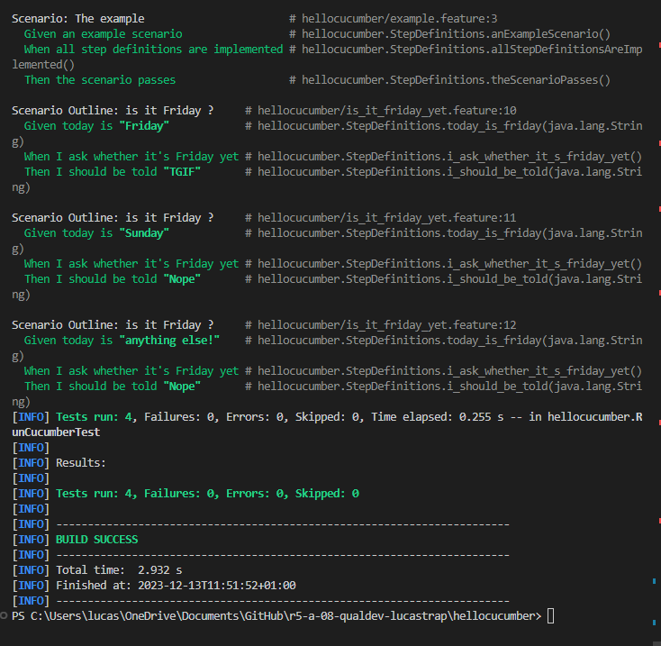
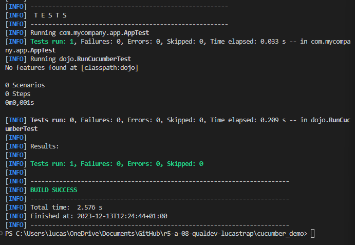
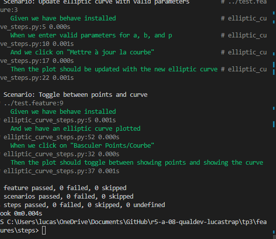

-- Dépôt pour les TPs

Ce dépôt concerne les rendus de mailto:luca.straputicari@etu.univ-tlse2.fr[luca.straputicari].

== TP1

.Exemple de code
[source,java]
---
Feature: It is Friday yet?
    Everybody wants to know when it's Friday
     
    Scenario Outline: is it Friday ?
    Given today is "<day>"
    When I ask whether it's Friday yet
    Then I should be told "<answer>"
    Examples:
        | day            | answer |
        | Friday         | TGIF   |
        | Sunday         | Nope   |
        | anything else! | Nope   |
---

== TP2
Order.java : 
[source,java]
---
public class Order {

    private String owner;
    private String target;
    private List<String> cocktails;
    private String message;

    public void declareOwner(String string){
        this.owner = string;
    }

    public void declareTarget(String string){
        this.target = string;
    }

    public List<String> getCocktails(int number){
        if (number ==0) {
            this.cocktails = new ArrayList<String>();
        }else{
            this.cocktails = new ArrayList<String>(number);
        }

        return this.cocktails;
    }
}
---

== TP3 

Ma feature : 

[source,python]
---
Feature: Traceur de Courbe Elliptique

  Scenario: Update elliptic curve with valid parameters
    Given we have behave installed
    When we enter valid parameters for a, b, and p
    And we click on "Mettre à jour la courbe"
    Then the plot should be updated with the new elliptic curve

  Scenario: Toggle between points and curve
    Given we have behave installed
    And we have an elliptic curve plotted
    When we click on "Basculer Points/Courbe"
    Then the plot should toggle between showing points and showing the curve

---

Objectif : Mon but en faisant ces tests était de tester que les actions de l'utilisateur de l'application n'entraine pas un crash de l'application, ainsi si un test ne passe pas je sais qu'il faudra que je regle un certain point sinon l'application crash.

